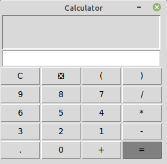
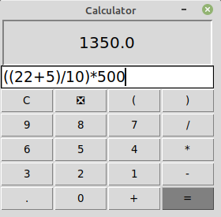

<h1>Basic Calculator</h1>

This calculator is build using Python and Tkinter module is used for Graphical User Interface

<section style="display: inline-block; margin: 10px;">
	<h3 style="text-align: center;">Basic View</h3>
	
</section>

<section style="display: inline-block; margin: 10px;">
	<h3 style="text-align: center;">Simple Calculation</h3>
	
</section>

<section style="display: inline-block; margin: 10px;">
	<h3 style="text-align: center;">Complex Calculation</h3>
	
</section>

<section style="display: inline-block; margin: 10px;">
	<h3 style="text-align: center;">Zero Division Error</h3>
	
</section>